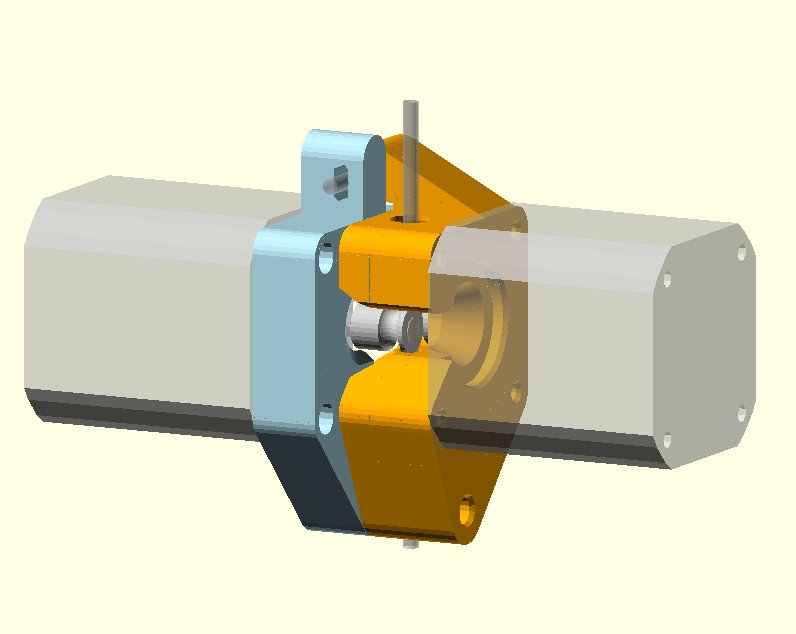

This is an *UNTESTED* work in progress of a parametric dual-motor NEMA14/NEMA17 bowden extruder for 3mm filament, inspired by the [bondtech](http://shop.bondtech.se/ec/extruders/) and [printrbot](http://printrbot.com/shop/gear-head-extruder-v0-01/) counter-rotating drive gear extruders.

# Why?

* Driving both sides of the filament seems like a good idea
* The bondtech extruder is beautiful but expensive
* You cannot reuse a 1.75mm bondtech extruder for 3mm filament (and vice versa)
* The printrbot extruder is not parametric and does not work for 3mm filament
* The components involved in this are not special, and can be acquired easily (versus intricate custom machined things)
* A normal NEMA17 doesn't seem to have enough power to direct drive 3mm via bowden by itself
* You could probably use dual NEMA14 motors to direct-drive 1.75mm filament (if you wanted to)

# Printing directions

Print with 0.6mm extrusion width and .3mm extrusion height.  The design is tuned for those dimensions.

# TODO
* testing
* knob for tensioner bolt/nut
* 1.75mm version

# BOM Work in progress that will likely change

## for 3mm extruder
* Two (2) NEMA17 motors, preferably 400-step.  I'm using one from [sparkfun](https://www.sparkfun.com/products/10846) but one with more power would be preferable.
* Two (2) Mk8 hobbed pulleys.  I bought mine from [twelvepro](http://twelvepro.com/index.php?route=product/product&product_id=75) and they're quite good.
* Eight (8) [10mm long m3 screws](http://www.mrmetric.com/metric-fasteners/metric-socket-head-cap-screws-ssa2/M10605.html).
* One (1) >40mm partially threaded m5 bolt for the hinge pivot.  I think one like [this one](http://www.mrmetric.com/metric-fasteners/hex-bolts-stainless-a-2/M40830.html) but I'm not sure.
* One (1) ~30mm m3 hex-head bolt for the tensioner. I'm currently trying [this one](http://www.mrmetric.com/metric-fasteners/hex-bolts-stainless-a-2/M40807.html) at the moment).
* One (1) m3 nyloc nut for the tensioner.  I'd recommend Mr. Metric.
* ~0.25" PTFE/PFA/HDPE tubing for the spool-side and/or hotend-side bowden tubes.
* Push-fit bowden insert (it's the insert of a bowden clamp that came with my e3d.  I think it's the same [as this](http://www.smw3d.com/e3d-embedded-bowden-coupling/).

Total cost is something like $50 USD.
